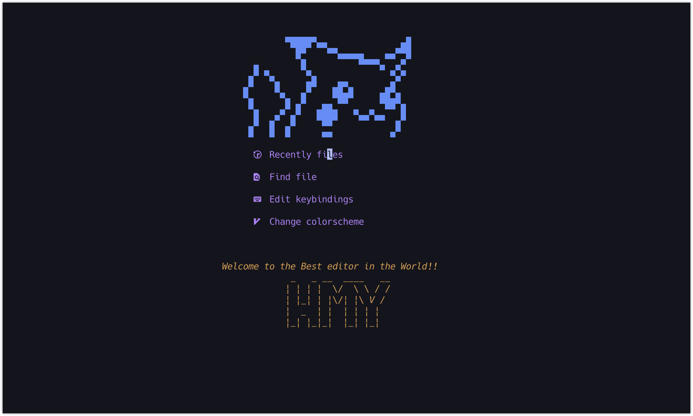

<div align = "center">
    <h2> My Neovim Config </h1>
</div>

[TOC]

### Start

首先说明 该配置基于 `MacOS` 可于 `linux` 兼容较好

前置要求：终端字体 `nord` terminal: `iterm2`，

windows 下可以安装一些美化的`shell` (对于 shell 要求不高，主要装一下字体就行，
如果你能忍受 vim 原生字体或者主题另说)

- `git clone git@github.com:AHFJE/MyNvim.git` 首先 `clone` 仓库

- 进入 `lua/plugins.lua` 运行`:w`或者`:PackerInstall`先下载插件

- 运行 `:checkhealth`查看有哪些依赖环境需要安装，安装一下就完事儿了，
  例如 `npm`、`go`，以及版本是否匹配等等

### Preview

先来看看配置完是什么样子的

<center class="half">

<h6>开始界面，一切都是高度可定制的</h6>
</center>

**下面介绍一些高级特性**

- 浮动大终端

<div align="center">
  
</div>

- 高级搜索 包括查找文件 字符串 历史命令

<div align="center">
  
</div>

- 查看 vim 寄存器 一键切换喜欢的主题

<div align="center">
  
</div>

- 查看目录 分屏操作

<div align="center">
  
</div>

- 可视化撤销历史 （无敌强）

<div align="center">
  
</div>

### Config

> 该文件有两个 `branch`，这个是 `master` 的配置，也是我目前在用的配置，另一个 `branch` 是
> `null-ls`，配置的是使用 `null-ls` 代替 `format` 的来进行格式化的插件。目前我正在致力于
> `null-ls的`开发，后续可能会更新更为强大的`Coc.nvim`。

文件目录架构

```txt
.
├── README.md
├── gif
├── img
├── init.lua
├── lua
│   ├── basic.lua
│   ├── colorscheme.lua
│   ├── file_keymap.vim
│   ├── keybindings.lua
│   ├── lsp
│   │   ├── cmp.lua
│   │   ├── common-config.lua
│   │   ├── config
│   │   │   ├── clangd.lua
│   │   │   ├── general.lua
│   │   │   ├── html.lua
│   │   │   ├── lua.lua
│   │   │   └── pyright.lua
│   │   ├── formatter.lua
│   │   ├── setup.lua
│   │   └── ui.lua
│   ├── plugin-config
│   │   ├── autopairs.lua
│   │   ├── bufferline.lua
│   │   ├── comment.lua
│   │   ├── dashboard.lua
│   │   ├── fidget.lua
│   │   ├── indent-blankline.lua
│   │   ├── lualine.lua
│   │   ├── markdown-preview.lua
│   │   ├── marks.lua
│   │   ├── nvim-tree.lua
│   │   ├── nvim-treesitter.lua
│   │   ├── telescope.lua
│   │   ├── toggleterm.lua
│   │   └── undotree.lua
│   └── plugins.lua
└── plugin
    └── packer_compiled.lua
```

**... 未完待续 有空再写**
